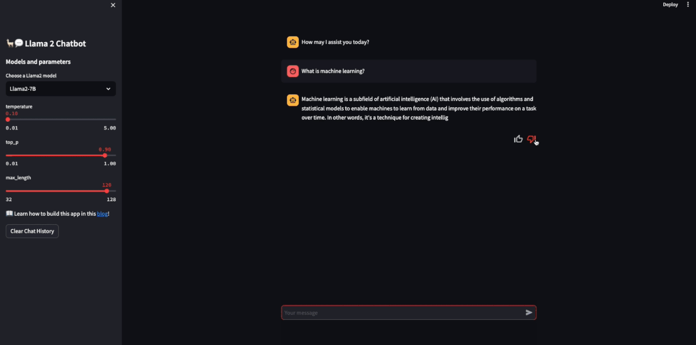

# LLMOps Nexus: A Kubernetes Native LLMOps Architecture Design

LLMOps Nexus is an innovative architecture design that showcases the automated orchestration of Large Language Models Operations (LLMOps) on any Kubernetes cluster, utilizing the power of open-source, container-native technologies 🚀🌐

## Architecture

## LLMOps Capabilities 🌟

### 1. LLM Monitoring

👁️ LLMOps Nexus employs Prometheus for vigilant monitoring of LLM (Large Language Model) serving modules. For demonstration, a Streamlit app serves the LLM, while Prometheus diligently scrapes metrics. Alert configurations are in place to promptly detect any performance issues.

### 2. Auto-triggering LLM Retraining/Fine-tuning

🔧 In response to model performance degradation, Prometheus alerts are generated. These alerts are adeptly managed by AlertManager, which coordinates with Argo Events to initiate a retraining pipeline, effectively fine-tuning the model.

### 3. Training, Evaluating, and Logging the Retrained LLM

🏋️‍♂️ Orchestrated by Argo Workflows, the retraining pipeline is customizable for specific LLM retraining, fine-tuning, and performance tracking. MLflow plays a crucial role in logging details of the retrained LLM.

### 4. Triggering the Generation of New Vectors for Fresh Data

🔄 Leveraging MinIO for unstructured data storage, LLMOps Nexus sets up Argo Events to monitor upload events. When new data is uploaded, a vector ingestion workflow is automatically triggered.

### 5. Ingesting New Vectors into the Knowledge Base

🔍 A vector ingestion pipeline, executed by Argo Workflows, uses LlamaIndex to generate and ingest vectors. These vectors are then stored in Milvus, serving as the knowledge base for retrieval-augmented generation.

## Stack Overview

Key components of LLMOps Nexus:

-   **ArgoCD:** Kubernetes-native continuous delivery tool, overseeing all components in the LLMOps Nexus stack.
    
-   **Argo Workflows:** Kubernetes-native workflow engine for executing vector ingestion and model retraining pipelines.
    
-   **Argo Events:** Kubernetes-native event-based dependency manager, linking applications and components, and initiating workflows based on specific events.
    
-   **Prometheus + AlertManager:** Crucial for monitoring and alert management, particularly regarding model performance.
    
-   **LlamaIndex:** Framework for bridging LLMs with data sources, utilized for efficient data ingestion and indexing.
    
-   **Milvus:** Kubernetes-native vector database, ideal for storing and querying vectors.
    
-   **MinIO:** Open-source object storage system for managing unstructured data.
    
-   **MLflow:** Open-source platform that handles the machine learning lifecycle, including experiment tracking and model management.
    
-   **Kubernetes:** Container orchestration platform that automates the deployment, scaling, and management of containerized applications.
    
-   **Docker Containers:** Essential for packaging and running applications consistently and reproducibly.

-   **Truera:** Provides model intelligence platform to analyze machine learning, improve model quality, and build trust.
    
-   **NVIDIA Triton Inference Server:** Optimizes inference serving for GPU and CPU, enabling low-latency and high-throughput serving of AI models.

## Demo Chatbot

LLMOps Nexus includes a Streamlit-based chatbot as a practical demonstration. This chatbot utilizes a Llama2 7B quantized model, with a Flask app providing metrics exposure and Redis facilitating communication between Streamlit and Flask processes.
